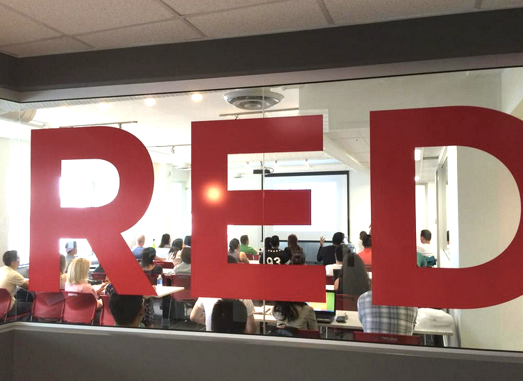
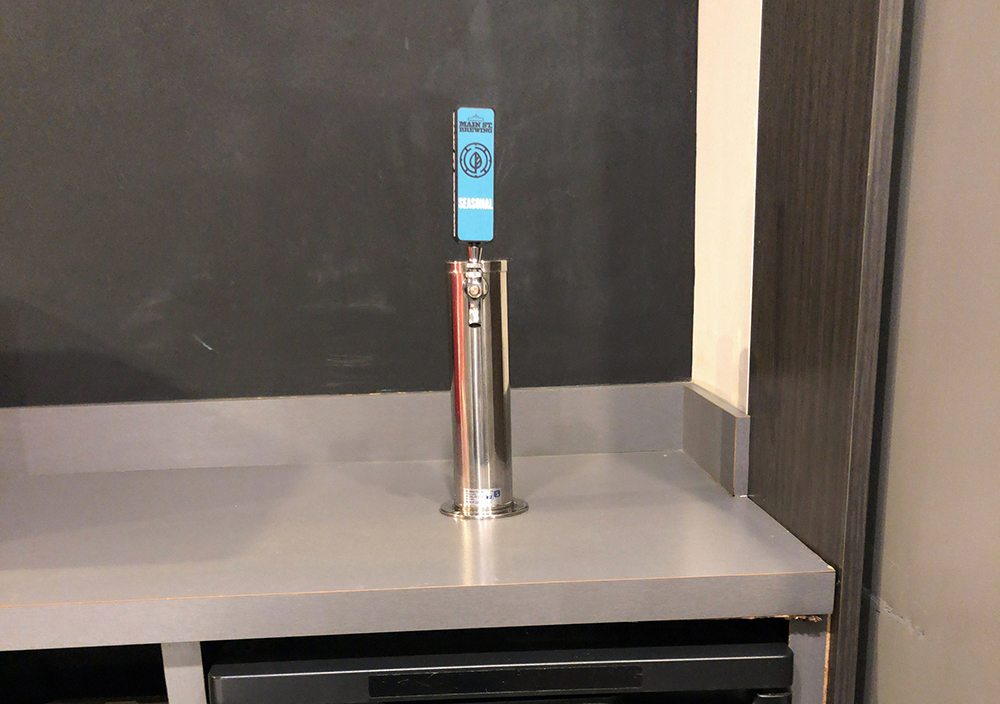

今回はカナダ、バンクーバーのITの専門学校、RED Academyについて紹介します。

私はここで勉強を始めて約5ヶ月になりますが、学校を決める前にバンクーバーの専門学校がどんな感じなのかネットに情報があまりなくて困ったので、これから学校を探す人の一つの参考になればと思います。

## RED Academyって何の学校？

RED Academyはデザインとテクノロジーに特化したプログラムを提供している学校です。
バンクーバー以外にもカナダのトロントとエドモントンの2ヵ所で開校しています。イギリスのロンドンにもあったようなのですが、ウェブサイトからはいつの間にか消えていたので詳細は不明です。

バンクーバーで似たようなところだとBCITという州立カレッジがあって、こちらも現地での就職に繋がる実践的な内容を教えてくれる学校として有名です。

### プログラム

じゃあ、**デザインとテクノロジーに特化したプログラム**って一体何なのっていうと、具体的には下記の3つになります。

- Digital Marketing

- UX & UI Design

- Web & App Development

下2つに関してはUXかUIだけ、WebかAppだけのコースも選ぶこともできます。
ちなみに私が受講してるのは、"Full-Stack Developer Work-Study"というものです。

名前が長くてわかりづらいですが、要するにWeb & App Developmentを1年学んだあと、Co-opというビザで実際の企業でフルタイムで半年働くことができるよーていうやつです。

"Work-study"は月〜木の夜間と土曜日に授業があるのですが、同じカリキュラムでも平日の昼間にみっちり授業を受けることで”Work-study”より短期間で卒業できる"Full-time"というのもあって、こちらはCo-opビザがついてないので外国人が少なくカナダ人が多く受講している印象があります。

さらにプログラムについて詳しく知りたい方は、学校のウェブサイトか日本語で紹介しているこちらのサイトを見てみてください。

[RED Academy - Redefining Education](https://redacademy.com/)

[Red Academy(レッドアカデミー)のすべて | 評判,口コミ,料金,割引](https://canada-school.com/school/redacademy/)

### 学費

プログラムの学費は、カナダ人は$19,500 CAD、外国人は$22,000 CAD(2020年2月時点)です。
これを高いととるか安いととるかは人によると思うのですが、私は日本の国立大学に4年間通うのに比べれば安く、しかも短い期間で将来性のあるスキルを磨けて、海外就職という目標に近づくことができると考えれば、意味のある投資なのかなと個人的に思います。

## 学校生活

### 設備

学校はかなり歴史を感じるビルの中の2階と3階にあります。外側は古めかしいですが、中はきれいです。それぞれの階にキッチンが備わっていて、コーヒーとお茶はいつでも飲めます。
自習できるスペースもかなり多くて、床に座ったり、ソファに寝そべったりと各々自由に過ごしてます。

あとワンちゃんが至る所にいて癒されまくるので犬好きとしてはたまりません🐶

犬天国も最高ですが私的にさらに最高な点は学校にビールタップがあることです。

一週間座りっぱなしでコーディングし続けた後の、皆と飲むビールはなんとも言いがたい達成感があります。お酒が飲めない人のために、ジュースとかもちゃんと用意されてます。

### クラス

私は現在、Web Development（Web Devと呼ばれてる）のクラスに在籍していて、週19時間の授業で計6ヶ月のカリキュラムを進めています。それが終わると、また別の6ヶ月間のApp Developmentのクラスに進む予定です。

#### クラスメイトの数は?

計11人です。その中で、男女比は9:2と、私とあと一人しか女性がおりません。

この偏りは他のDigital MarketingやUX&UI Designでは起きておらず、Web&Appのコースのみの現象なので、プログラミングを学ぶ女性というのはまだまだ少ないんだなーと感じてます。

#### 国籍比率は？

日本からは私一人で、あとはカナダ、インド、中国、イギリス、ブラジル、メキシコ、コロンビアとほとんどが外国からの生徒で、特に南米からが半数を占めています。

#### 経験者はどれくらい？

IT未経験の生徒がほとんどですが、Javaを使って仕事をしていた人や、Conputer Scienceを母国の大学で専攻していた人などプログラミングに詳しい人も数人います。

### カリキュラム

半年間のWeb devのカリキュラムはWeb制作の基本的なスキルであるHTML,CSSから始まって月一ごとに課題として出されるプロジェクトをこなしながら、Javascript, JQuery, PHP, Wordpressという感じで学んでいってます。Reactは、このあとのApp developmentのコースでNode.jsなどと一緒に勉強する予定です。

Web Devでは計6つのプロジェクトがあり、今のところそのうちの4つが終わっていて、残りのプロジェクトはGit hub上でポートフォリオを作ったり、UX&UI Designのクラスと協力して実際にクライアントにWebサイトを作っていく予定です。

## 英語力

もちろんですが、授業は全て英語で進んでいきます。学校への入学基準として、高校卒業の資格とIELTS 6.5以上(ほかの英語のテストでもOK)が必要になり、あとは学校スタッフとのSkypeでのインタビューがあるので、留学生でも入学時点でかなり英語が話せる人が多いです。

じゃあ私はというと、IELTS6.5をなんとか取得し、インタビューもパスしたものの、残念ながらクラスの中では英語力がダントツで低いです。もう圧倒的に低い。グループワークとかでみんなが自分の意見バンバン言ってる間、一言も発することができず、作り笑顔と激しめのうなずきだけで生き延びてました。

ただ、この5ヶ月間ついていくのに必死すぎて気づきませんでしたが、振り返ってみると自分の英語力がすごい伸びたなと感じます。バイトを始めたのももちろん理由の一つだと思いますが、学校は日本語で助けを求めることができない環境なので、めちゃくちゃな英語でも毎日先生に質問したり、他のクラスメイトと助けあったりしていると英語のスピーキングやリスニングへの障壁がだんだん下がってきて、コミュニケーションが取れるようになってきました。まだまだ、会社で働くには不安だらけなので、自分で努力していこうと思います。

## まとめ

こんな感じで学校紹介は終わりです。

総合的にRED Academyにはかなり満足してます。

先生は知識豊富な人が多く、学校の授業だけでなく個人的に勉強していて行き詰まったときにも助けてくれて、頼れる存在ですし、クラスメイトも協力して高めあっていこうという意識があるので、互いに情報を共有しあったりして、みんなで頑張っています。

もちろん学校に行くだけで、就職できるかと言ったら違って、結局は自分次第なのは当たり前ですが、生徒の勉強へのモチベーションを保つための工夫や就職へのサポートを学校側が最大限にしてくれてるなというのは日々感じており、スタッフがそういった環境作りをしてくれてることにはとても感謝しています。

今後も学校生活で何かあれば共有していこうと思います！